# Altium Designer 入门教程

> 注：使用了引用语法但不是引用：
>
> 以下内容有部分来源于网络、博客等等，结尾会给出参考链接。(๑•ั็ω•็ั๑)
>
> 希望大家可以自觉的在**转载、转发**时**著名出处**。(๑• . •๑)
>
> 预防侵权，支持原创，支持开源，从你我做起。=￣ ω ￣=

```text
/**
 * Copyright(C),2019-2020,xudongpo.cn
 * Author: 许东坡
 * Email: aelousdp@163.com
 * Date: 2019.11.26
 * Version: 1.0.0
 * Description: Altium Designer入门
 * Function List:
    前言
    安装软件
    新建工程
    绘制库
    绘制原理图
    生成PCB
    绘制PCB
    结束语
    引用致谢
    附录
 * History: NULL
 * Others: NULL
**/
```

## 前言

我本身是硬件出身的，最开始接触的是**protel 99SE**，非常轻量，用来画一些简单的电路图作为入门是可以的，之后做比赛接触到了**Altium Designer**（以下简称 AD），其实 AD 对于我们现阶段的使用其实是够用了，网上很多人说**Candence**很厉害，包括我身边以前实验室的朋友都夸它好，有人夸说明肯定又优势，但是都是一门工具，要我说，武功再好，也怕菜刀，工具趁手，就是好工具。

而且现在大家也没有太多的时间去接触这么多，我就直接的讲一讲 AD 的一些基本入门。

> 文中，采用引用样式（这段话这个样子的）均为作者有话说，必须一看，根据自己的实际情况选择是否要学。

话不多说，开始正题：

```text
测试分页，请忽略。
```

<div STYLE="page-break-after: always;"></div>

## 安装软件

工欲善其事，必先利其器。以下是我常用的软件版本。

个人分享的文件链接：<链接: https://pan.baidu.com/s/1mbmtB4Sn6gOg9iWDayEzcg 提取码: yxfi>

个人分享的替换文件：<链接: https://pan.baidu.com/s/1uQ2w2YVgq93rg31SAk3FTQ 提取码: dxu9>

文件具体内容如下：


因为个人原因，电脑存储不够，先不进行下载安装，具体详细的安装过程找时间补齐。

文件链接中，有详细的安装教程，**破解** 只需要将替换文件进行替换即可。如果您已经完成了软件的安装，可以直接跳过此步骤。

最开始一直使用的是 09 版本，由于 09 和 10 的中文在 PCB 打印丝印层的时候会有字体错误，遂选用了 15 版本。如有其他版本，不用担心，再次强调，软件只是工具，工具不重要，知道怎么用才重要。

剑客有云，心中有剑，手中无剑。

## 新建工程

下面以个人电脑做示范，开始新建一个工程，完成一个**小工程的绘制**：具体内容暂时选定为简单的**光控灯实例**，毕竟**授人以鱼不如授人以渔**本教程目的在于带领大家熟悉软件，告诉大家一些我可能遇到的问题。如有补充可以联系作者：_aelousdp@163.com_

### 新建

点击 File -> New -> Project 新建一个工程

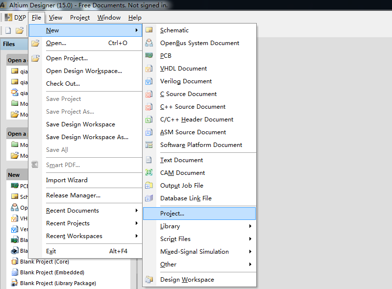

### 选择

选择默认即可，根据个人工程位置修改 Name(文件名) 和 Location(路径)


> 注：希望大家在新建工程的时候，养成一个良好的习惯，严禁用 a、aa、bbb 等命名，实在是太业余了，还有工程路径，一定要定义一个合理的文件夹，方便自己找得到的那种，每个工程文件都是自己知识的结晶，是自己努力的成果，不可懈怠。

Repository(仓库)和对应的 Folder(文件夹)不需要选择，进入工程之后我们再导入。

### 建立完成

建好的工程如下所示：诺，一片空白，不要慌，一步一步来。

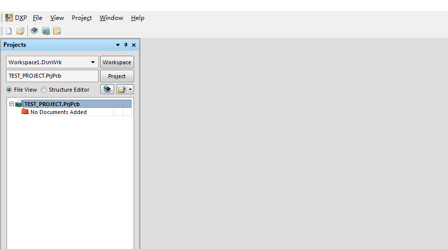

### 额外补充：设置中文方式：

DXP -> Preferences -> System -> General

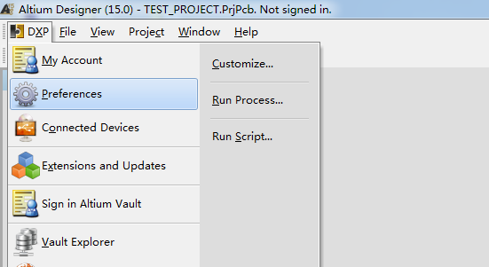

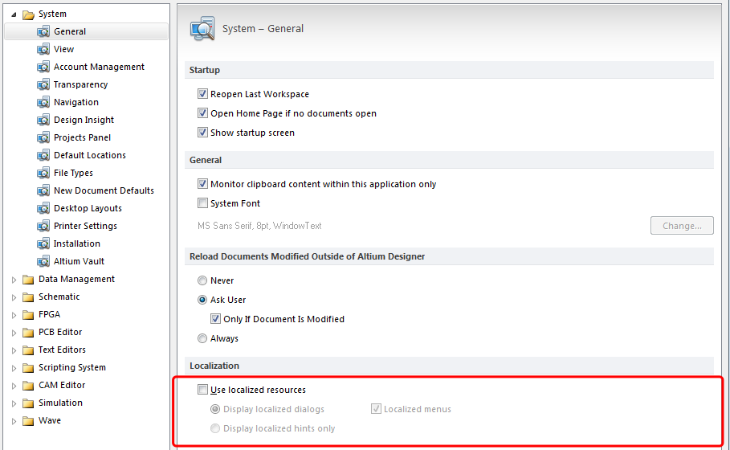

点选**Use localized resources**，弹窗点击 OK，然后点击 Apply。重启 AD 即可。

不过不建议使用中文，如果连这点英文都不懂，英文芯片手册看不了，不适合做硬件了。

重启后中文界面如下所示：


### 创建文件

本步骤本来在绘制库中，二次修改做出调整。

### 新建原理图库

打开刚才我们建立好的工程，点击 File -> New -> Library -> Schematic Library 具体操作如下，新建原理图库：

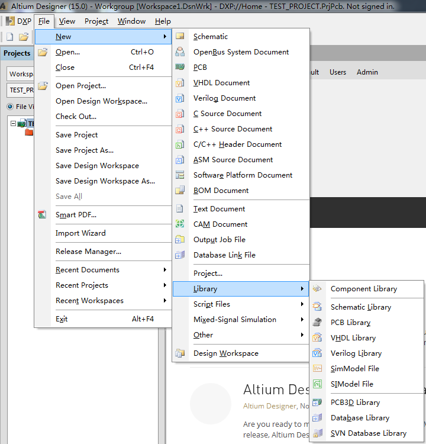

建好的库如下所示：

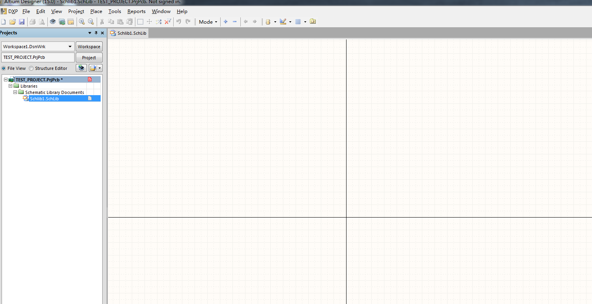

什么都没有，还是不要慌，我们先操作以下界面，鼠标点击界面一次，按下键盘 shift 键，滚动鼠标滚轮（没有鼠标请淘宝购买），屏幕会左右滚动，按下 ctrl 滚动鼠标滚轮，屏幕会放大缩小，右键长按，可以进行拖拽。

保存文件，自己重新命名。

具体的快捷键在查询资料后会建立附录提供给大家。

### 新建封装库

我们建立好原理图库之后，要给对应的原理图库建立对应的封装库。

点击 File -> New -> Library -> PCB Library 具体操作如下，新建封装库：


快捷键与原理图库类似，自己保存。

### 创建原理图文件

接下来我们创建**原理图文件**
点击 File -> New -> Schematic 具体操作如下，新建封装库：


自己保存并重命名。

### 创建 PCB 文件

接下来我们创建**PCB 文件**
点击 File -> New -> PCB 具体操作如下，新建封装库：

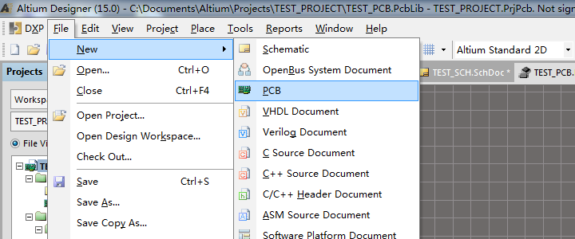

自己保存并重命名。

## 绘制库

现在我们的文件结构如下所示：

- Project
  - Source Documents
    - TEST_SCH.SchDoc (原理图文件)
    - TEST_PCB.PcbDoc (PCB 文件)
  - Libraies
  - PCB Lib
    - TEST_PCB.PcbLib (PCB 库)
  - Schematic Lib
    - TEST_SCHLIB.SchLib (原理图库)

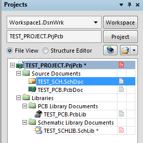

接下来，我们由 “0” 开始生 “1”。

### 确定器件

> 说明：很多时候，我们参与一个项目，项目的库什么的并不需要我们自己去完成，很多实验室/公司/团体的前辈们已经完成了，我们需要尽快去熟悉查看被人绘制完毕的库即可。但是！！！这些都是基本功，还是得懂，因为总有些东西是你没有接触到的，是新的元器件，新的封装，所以深学必须掌握，工作可以选学。

首先，我们要知道，我们要完成的是一个光控灯，光控灯的原理图如下图所示：

<image src="images/光控灯原理图.png" height="300px" style="display:block" alt="光控灯原理图"></image>

其实稍微懂点硬件的朋友一看就知道，电阻 R2 既是光敏电阻，Q1 为 NPN 三极管，由 R1 和 R2 进行分压，控制 Q1 开关，实现 LED1 的亮灭。

我们对以上的几个器件进行绘制，个人原因，具体物件图均来源于百度图片：
选择器件有：碳膜电阻 ｜ 光敏电阻 ｜ Φ5 直插 LED ｜ 2N3904

<image src="images/碳膜电阻.png" height="150px" style="display:inline" alt="碳膜电阻"></image><image src="images/光敏电阻.png" height="150px" style="display:inline" alt="光敏电阻"></image><image src="images/直插LED.png" height="150px" style="display:inline" alt="直插LED"></image><image src="images/NPN三极管.png" height="150px" style="display:inline" alt="NPN三极管"></image>

电池部分就不画了，直接留开窗接稳压电源即可。

现在我们已经确定了我们需要的东西(现实中的物件)，有了软件创建的工程以及对应的原理图库和封装库。

### 绘制原理图库

#### 碳膜电阻原理图

我们这里并不绘制集成封装，所以每个元件都是先绘制原理图库，再绘制封装库，首先绘制碳膜电阻原理图库，原理图库，顾名思义，是在我们绘制原理图时为我们提供方便的库，软件安装时，系统就已经提供了一些常用的库，其实已经有了电阻等元件。我们先不管官方提供的，我们自己从头开始画，学习永远是一个痛苦的过程，从无到有。

打开我们建立的原理图库。一片空白。

点击如下位置（或者按下快捷键 P + L ）：

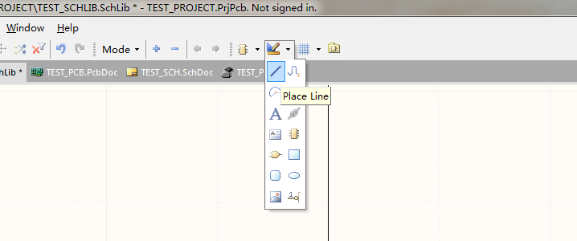

点击空白处，熟悉以下画线，然后画出一个矩形如下：

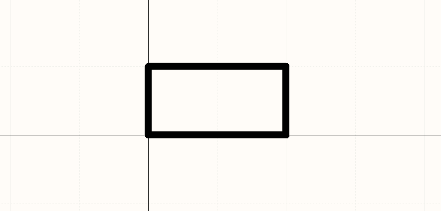

当然如果你有多的时间，也可以逐一实验绘制区域的每一个功能。希望大家有兴趣可以尝试。

接下来双击矩形，在弹窗中双击 color，选择一种蓝色，看起来好看点的其他颜色其实也行。点击确认，矩形颜色变蓝。

点击如下位置（或者按下快捷键 P + P ）：

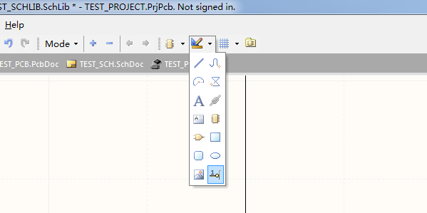

此时鼠标点击空白处，会有一根引脚出现，按下**空格键**可以**旋转 90 度**，点击两次出现两个引脚，右键取消点选。

> 所有的快捷键都需要自己一遍一遍的去熟悉。只要功夫深，铁杵磨成针，都是熟练的事。

大家可能绘制的时候，遇到我现在遇到的尴尬境地：

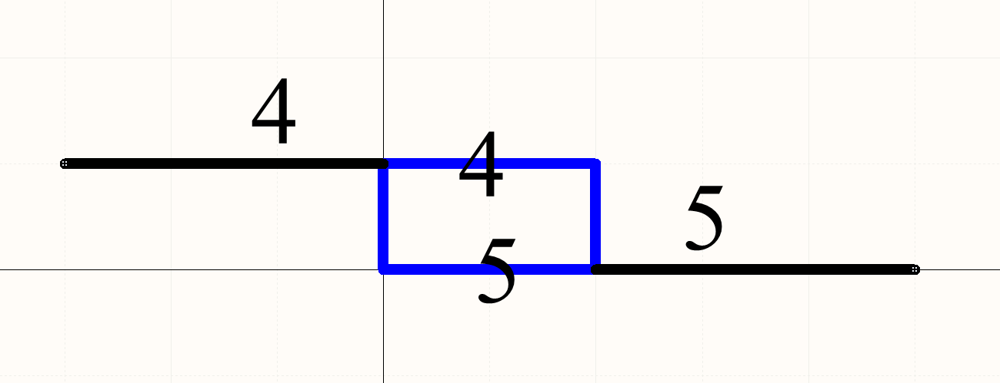

引脚怎么都移动不到蓝色的纵轴中间去。这时候点击栅格：

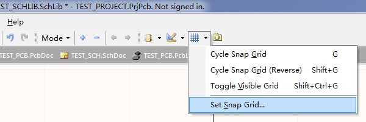

在弹窗中将 10 改为 1，这是你可以移动的最小单位就变小了。

我们将引脚位置摆放如下：注意方向，仔细看**引脚有一端是有个小白点**，表示这一端是有电气连接的，一定要朝外。

双击引脚，可以对 Display Name(显示名)和 Designator(指示器)以及长度，大小进行修改。

> 注：显示名可以随意，但是指示器一定要从 1 开始，1.2.3... 这样。根据元件自身封装引脚顺序定义来绘制。

自己琢磨琢磨，把元件绘制成如下样式：

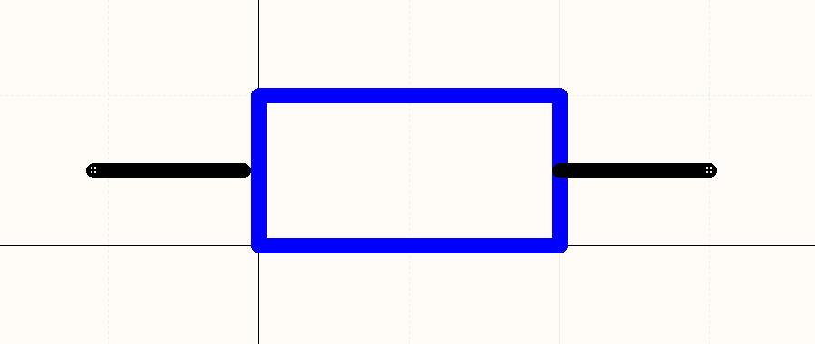

这样我们的一个电阻原理图封装，就绘制完毕了。点击 Tools -> Rename Compontent 对元件进行重命名为 TEST_RES 即可。

此时回到原理图文件，在右侧 Libraries 中找到我们的原理图库：

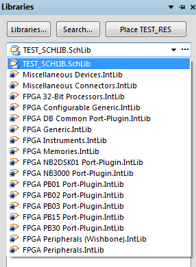

点击，即可看到对应的元件，双击，在空白处即可放置。

#### 其他元件

- 光敏电阻，很简单，在这个电阻的基础上，加几个箭头表示光敏即可。回到原理图库，点击 Tools -> New Component，新建一个元件。将之前的复制粘贴过来，然后画个箭头即可。就不做详细示范了。
- 绘制直插 LED，emmmm，我相信这个大家摸索摸索都可以画出来，就是画画。原理图主要是为了方便人类看得懂。
- 绘制 2N3904，同理，不详细说明，如果有问题可以联系作者。

### 绘制封装库

#### 碳膜电阻封装

同理也只绘制简单的碳膜电阻封装，原理都是一样的，如果学习过程中遇到问题，可以联系作者。

大家要合理的培养自己解决问题的能力。

打开原理图库，直接使用快捷键（ P + P ）或者上方工具栏。就会出现一个焊盘，根据栅格作为基准，放置第一个焊盘如下：

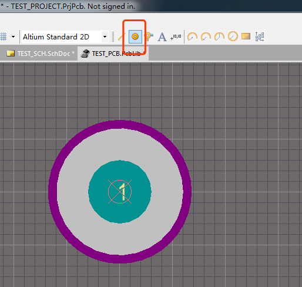

我们根据实物图可以看出，碳膜电阻共有两个引脚。我们选用的是直插电阻，在 PCB 上的封装是单列直插风格，就是两个焊盘在一条线上，具体间隔根据具体封装决定。

```text
mil（中文译音：密耳），即千分之一英寸，等于0.0254mm（毫米）
常用直径尺寸的密尔与毫米换算如下：
- 1.0mil = 0.025mm
- 1.2mil = 0.030mm
- 1.25mil = 0.032mm
- 100mil = 2.54mm
```

我们一般用的排阵尺寸间距为 2.54mm，也就是 100mil。水平间隔 100mil 放置第二个焊盘。左上角有对应的做标尺，如果并不确定。放置之后按下快捷键（ R + M ）进行测量。然后进行微调即可。

测量图如下：
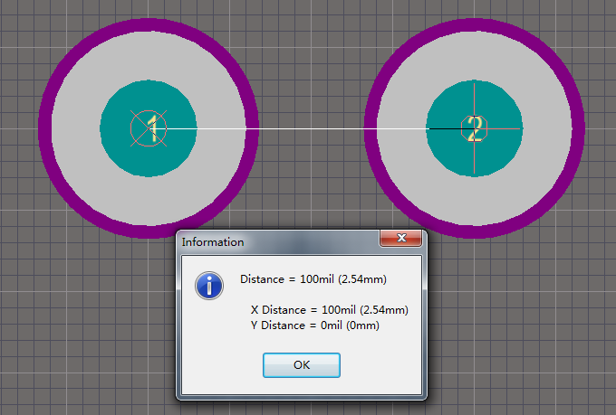

由于我们要将电阻放倒焊接，经过测量，距离应该是 300mil，再
次调整至 300mil。

接下来，我们给固定好的焊盘绘制外边框，就是在 PCB 上显示的出的白色线条。点击选择 Top Overlay 层，按下 P + L 进行绘制。结果如下：

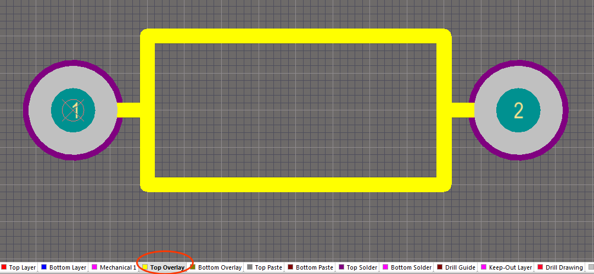

保存即可，这样一个电阻元件的封装就绘制完成了，如果是其他元器件同理。

## 绘制原理图

点开原理图文件，我们将我们自己绘制的电阻放入原理图中，然后再加入光敏电阻，LED 灯以及 NPN 三极管。

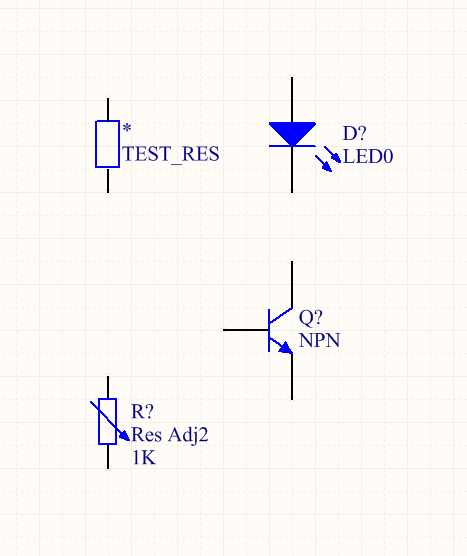

连线完成原理图绘制。

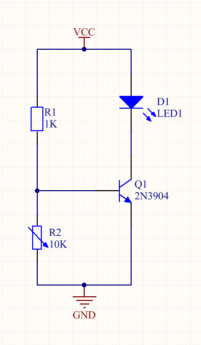

### 添加封装

接下来，给每个元器件添加封装，双击元件。

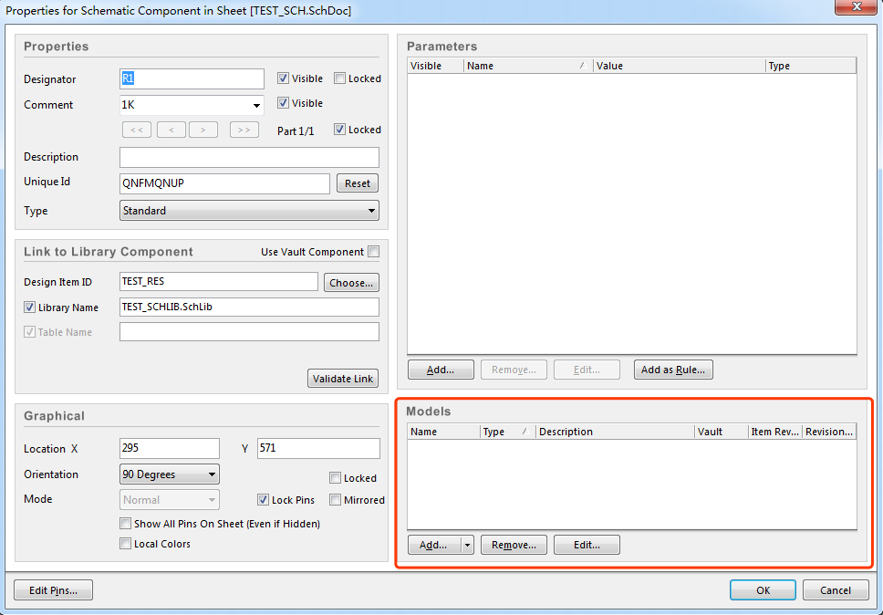

在 Models 中点击 Add，选择 Footprint 模型，Browse 浏览文件，会看到我们之前绘制的封装。

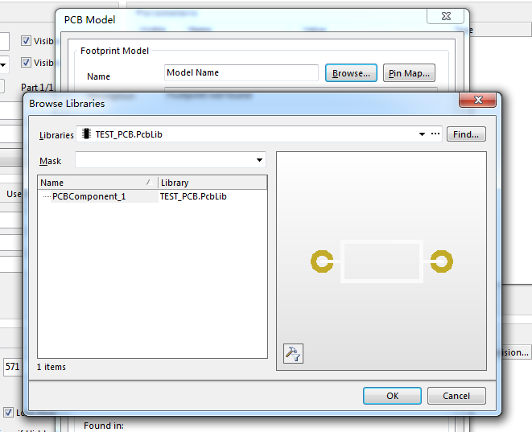

选择点击 OK 即可。其他对应的元件也选择对应的封装即可。

## 生成 PCB

原理图界面点击：Design -> Update PCB Document。

在弹出界面，点击，Validate Changes 以及 Execute Changes。

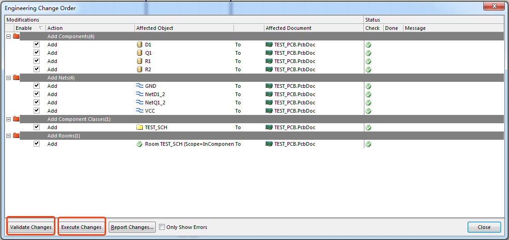

Close 即可。

## 绘制 PCB

这时候自动跳转到了 PCB 绘制界面，一片漆黑，不要怕，其实元件已经被摆放在一边了，只是在界面之外。ctrl 滚轮，缩小界面。

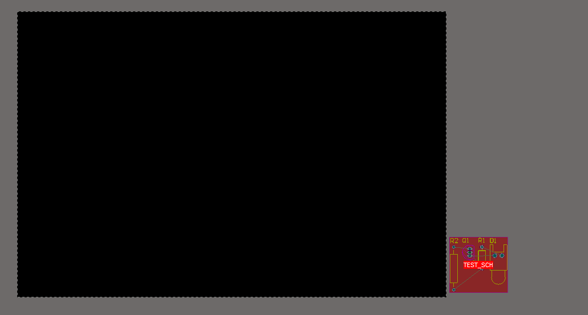

将元件先摆放好。

> 摆放的时候会发现有白色的指示线，目的就是，避免白色指示线交叉过多。白色指示线表示电气连接，就是最后要将他们连接在一起的。

摆放结束，切换层到 Top Layer 层，按下快捷键 P + T 进行连接。绘制完毕，如图所示。

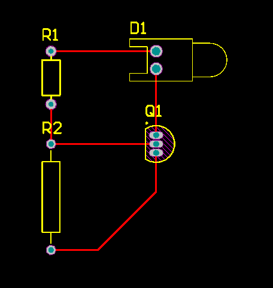

切换到 Keep-Out Layer 层，绘制板子大小。绘制过程中，按下 shift + 空格 可以切换线型。

丝印层（Top Overlay）自行调节摆放位置。

绘制结果如下：

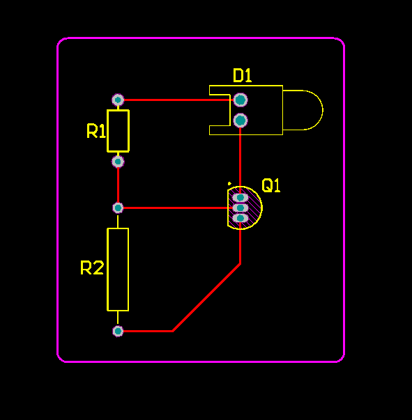

选中边框，点击 Design -> Board Shape -> Define from selected objects。

重新定义板子外形。最终如下。

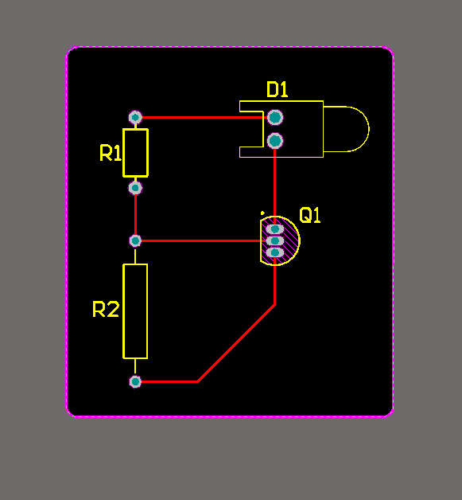

按下 3，观察 3D 视图如下：

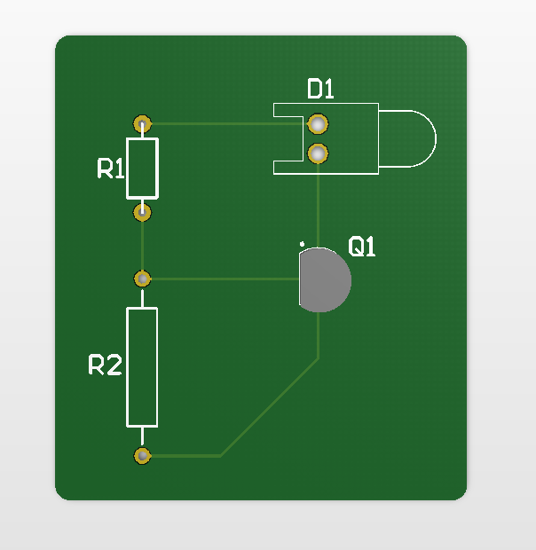

## 结束语

其实这个案例非常简单，但是本文目的就是带大家走一遍过程，所谓入门，就是你知道一件事情的流程，知道如何实现。所谓进阶，就是一遍一遍的走这个流程，直到你闭着眼也知道怎么走。

这个工具我也很多年没用了。可是上手的一瞬间，各种快捷键，当年画板子的技巧，全都在心里了。这些教没用，要大家自己画然后去摸索。

> 对我个人而言，任何一件事都是熟能生巧，大家在学习的过程中，学什么板子就画什么板子，学 8051 单片机，那就画几个 51 板子，学 STM32，那就画几个 32 板子。不同的封装，不同的型号，不同的功能。画的多了，就什么都会了。

之后会持续更新，敬请期待。

## 引用致谢

非常感谢如下链接：

聚优致成的博客：<http://blog.csdn.net/qq_29350001/article/details/52199356>感谢您的博客让我受益匪浅。

单位换算：<https://blog.csdn.net/yanchuan23/article/details/88649771>

> 强烈推荐： 上述博客推荐大家有时间看看，有些非常好，写的很详细，包括很多规则定义的进阶部分。

## 附录一：快捷键

### 原理图 && PCB 通用

<div style="overflow-x: auto;
    margin-bottom: 24px;"><table border="1" cellspacing="0" cellpadding="0" style="color:rgb(51,51,51);line-height:26px;"><tbody><tr><td valign="top"><p align="center"><span style="font-family:'Microsoft YaHei';font-size:18px;">快捷键</span></p></td><td valign="top"><p align="center"><span style="font-family:'Microsoft YaHei';font-size:18px;">相关操作</span></p></td></tr><tr><td valign="top"><p><span style="font-family:'Microsoft YaHei';font-size:18px;">Shift</span></p></td><td valign="top"><p><span style="font-family:'Microsoft YaHei';font-size:18px;">当自动平移时，加速平移</span></p></td></tr><tr><td valign="top"><p><span style="font-family:'Microsoft YaHei';font-size:18px;">Y</span></p></td><td valign="top"><p><span style="font-family:'Microsoft YaHei';font-size:18px;">放置元件时，上下翻转</span></p></td></tr><tr><td valign="top"><p><span style="font-family:'Microsoft YaHei';font-size:18px;">X</span></p></td><td valign="top"><p><span style="font-family:'Microsoft YaHei';font-size:18px;">放置元件时，左右翻转</span></p></td></tr><tr><td valign="top"><p><span style="font-family:'Microsoft YaHei';font-size:18px;">Shift+↑（↓、←、→）</span></p></td><td valign="top"><p><span style="font-family:'Microsoft YaHei';font-size:18px;">在箭头方向以10个栅格为增量移动光标</span></p></td></tr><tr><td valign="top"><p><span style="font-family:'Microsoft YaHei';font-size:18px;">↑、↓、←、→</span></p></td><td valign="top"><p><span style="font-family:'Microsoft YaHei';font-size:18px;">在箭头方向以1个栅格为增量移动光标</span></p></td></tr><tr><td valign="top"><p><span style="font-family:'Microsoft YaHei';font-size:18px;">Esc</span></p></td><td valign="top"><p><span style="font-family:'Microsoft YaHei';font-size:18px;">退出当前命令</span></p></td></tr><tr><td valign="top"><p><span style="font-family:'Microsoft YaHei';font-size:18px;">End</span></p></td><td valign="top"><p><span style="font-family:'Microsoft YaHei';font-size:18px;">刷新屏幕</span></p></td></tr><tr><td valign="top"><p><span style="font-family:'Microsoft YaHei';font-size:18px;">Home</span></p></td><td valign="top"><p><span style="font-family:'Microsoft YaHei';font-size:18px;">以光标为中心刷新屏幕</span></p></td></tr><tr><td valign="top"><p><span style="font-family:'Microsoft YaHei';font-size:18px;">PageDown或Ctrl+鼠标滑轮</span></p></td><td valign="top"><p><span style="font-family:'Microsoft YaHei';font-size:18px;">以光标为中心缩小画面</span></p></td></tr><tr><td valign="top"><p><span style="font-family:'Microsoft YaHei';font-size:18px;">PageUp或Ctrl+鼠标滑轮</span></p></td><td valign="top"><p><span style="font-family:'Microsoft YaHei';font-size:18px;">以光标为中心放大画面</span></p></td></tr><tr><td valign="top"><p><span style="font-family:'Microsoft YaHei';font-size:18px;">鼠标滑轮</span></p></td><td valign="top"><p><span style="font-family:'Microsoft YaHei';font-size:18px;">上下移动画面</span></p></td></tr><tr><td valign="top"><p><span style="font-family:'Microsoft YaHei';font-size:18px;">Shift+鼠标滑轮</span></p></td><td valign="top"><p><span style="font-family:'Microsoft YaHei';font-size:18px;">左右移动画面</span></p></td></tr><tr><td valign="top"><p><span style="font-family:'Microsoft YaHei';font-size:18px;">Ctrl+Z</span></p></td><td valign="top"><p><span style="font-family:'Microsoft YaHei';font-size:18px;">撤销上一次操作</span></p></td></tr><tr><td valign="top"><p><span style="font-family:'Microsoft YaHei';font-size:18px;">Ctrl+Y</span></p></td><td valign="top"><p><span style="font-family:'Microsoft YaHei';font-size:18px;">重复上一次操作</span></p></td></tr><tr><td valign="top"><p><span style="font-family:'Microsoft YaHei';font-size:18px;">Ctrl+A</span></p></td><td valign="top"><p><span style="font-family:'Microsoft YaHei';font-size:18px;">选择全部</span></p></td></tr><tr><td valign="top"><p><span style="font-family:'Microsoft YaHei';font-size:18px;">Ctrl+S</span></p></td><td valign="top"><p><span style="font-family:'Microsoft YaHei';font-size:18px;">存储当前文件</span></p></td></tr><tr><td valign="top"><p><span style="font-family:'Microsoft YaHei';font-size:18px;">Ctrl+C</span></p></td><td valign="top"><p><span style="font-family:'Microsoft YaHei';font-size:18px;">复制</span></p></td></tr><tr><td valign="top"><p><span style="font-family:'Microsoft YaHei';font-size:18px;">Ctrl+X</span></p></td><td valign="top"><p><span style="font-family:'Microsoft YaHei';font-size:18px;">剪切</span></p></td></tr><tr><td valign="top"><p><span style="font-family:'Microsoft YaHei';font-size:18px;">Ctrl+V</span></p></td><td valign="top"><p><span style="font-family:'Microsoft YaHei';font-size:18px;">粘贴</span></p></td></tr><tr><td valign="top"><p><span style="font-family:'Microsoft YaHei';font-size:18px;">Ctrl+R</span></p></td><td valign="top"><p><span style="font-family:'Microsoft YaHei';font-size:18px;">复制并重复粘贴选中的对象</span></p></td></tr><tr><td valign="top"><p><span style="font-family:'Microsoft YaHei';font-size:18px;">Delete</span></p></td><td valign="top"><p><span style="font-family:'Microsoft YaHei';font-size:18px;">删除</span></p></td></tr><tr><td valign="top"><p><span style="font-family:'Microsoft YaHei';font-size:18px;">V+D</span></p></td><td valign="top"><p><span style="font-family:'Microsoft YaHei';font-size:18px;">显示整个文档</span></p></td></tr><tr><td valign="top"><p><span style="font-family:'Microsoft YaHei';font-size:18px;">V+F</span></p></td><td valign="top"><p><span style="font-family:'Microsoft YaHei';font-size:18px;">显示所有选中</span></p></td></tr><tr><td valign="top"><p><span style="font-family:'Microsoft YaHei';font-size:18px;">Tab</span></p></td><td valign="top"><p><span style="font-family:'Microsoft YaHei';font-size:18px;">编辑正在放置的元件属性</span></p></td></tr><tr><td valign="top"><p><span style="font-family:'Microsoft YaHei';font-size:18px;">Shift+C</span></p></td><td valign="top"><p><span style="font-family:'Microsoft YaHei';font-size:18px;">取消过滤</span></p></td></tr><tr><td valign="top"><p><span style="font-family:'Microsoft YaHei';font-size:18px;">Shift+F</span></p></td><td valign="top"><p><span style="font-family:'Microsoft YaHei';font-size:18px;">查找相似对象</span></p></td></tr><tr><td valign="top"><p><span style="font-family:'Microsoft YaHei';font-size:18px;">Y</span></p></td><td valign="top"><p><span style="font-family:'Microsoft YaHei';font-size:18px;">Filter选单</span></p></td></tr><tr><td valign="top"><p><span style="font-family:'Microsoft YaHei';font-size:18px;">F11</span></p></td><td valign="top"><p><span style="font-family:'Microsoft YaHei';font-size:18px;">打开或关闭Inspector面板</span></p></td></tr><tr><td valign="top"><p><span style="font-family:'Microsoft YaHei';font-size:18px;">F12</span></p></td><td valign="top"><p><span style="font-family:'Microsoft YaHei';font-size:18px;">打开或关闭Sch Filter面板</span></p></td></tr><tr><td valign="top"><p><span style="font-family:'Microsoft YaHei';font-size:18px;">H</span></p></td><td valign="top"><p><span style="font-family:'Microsoft YaHei';font-size:18px;">打开Help菜单</span></p></td></tr><tr><td valign="top"><p><span style="font-family:'Microsoft YaHei';font-size:18px;">F1</span></p></td><td valign="top"><p><span style="font-family:'Microsoft YaHei';font-size:18px;">打开Knowledge center菜单</span></p></td></tr><tr><td valign="top"><p><span style="font-family:'Microsoft YaHei';font-size:18px;">W</span></p></td><td valign="top"><p><span style="font-family:'Microsoft YaHei';font-size:18px;">打开Window菜单</span></p></td></tr><tr><td valign="top"><p><span style="font-family:'Microsoft YaHei';font-size:18px;">R</span></p></td><td valign="top"><p><span style="font-family:'Microsoft YaHei';font-size:18px;">打开Report菜单</span></p></td></tr><tr><td valign="top"><p><span style="font-family:'Microsoft YaHei';font-size:18px;">T</span></p></td><td valign="top"><p><span style="font-family:'Microsoft YaHei';font-size:18px;">打开Tools菜单</span></p></td></tr><tr><td valign="top"><p><span style="font-family:'Microsoft YaHei';font-size:18px;">P</span></p></td><td valign="top"><p><span style="font-family:'Microsoft YaHei';font-size:18px;">打开Place菜单</span></p></td></tr><tr><td valign="top"><p><span style="font-family:'Microsoft YaHei';font-size:18px;">D</span></p></td><td valign="top"><p><span style="font-family:'Microsoft YaHei';font-size:18px;">打开Design菜单</span></p></td></tr><tr><td valign="top"><p><span style="font-family:'Microsoft YaHei';font-size:18px;">C</span></p></td><td valign="top"><p><span style="font-family:'Microsoft YaHei';font-size:18px;">打开Project菜单</span></p></td></tr><tr><td valign="top"><p><span style="font-family:'Microsoft YaHei';font-size:18px;">Shift+F4</span></p></td><td valign="top"><p><span style="font-family:'Microsoft YaHei';font-size:18px;">将所有打开的窗口平均平铺在工作区内</span></p></td></tr><tr><td valign="top"><p><span style="font-family:'Microsoft YaHei';font-size:18px;">Ctrl+Alt+O</span></p></td><td valign="top"><p><span style="font-family:'Microsoft YaHei';font-size:18px;">选择需要打开的文件</span></p></td></tr><tr><td valign="top"><p><span style="font-family:'Microsoft YaHei';font-size:18px;">Alt+F5</span></p></td><td valign="top"><p><span style="font-family:'Microsoft YaHei';font-size:18px;">全屏显示工作区</span></p></td></tr><tr><td valign="top"><p><span style="font-family:'Microsoft YaHei';font-size:18px;">Ctrl+Home</span></p></td><td valign="top"><p><span style="font-family:'Microsoft YaHei';font-size:18px;">跳转到绝对坐标原点</span></p></td></tr><tr><td valign="top"><p><span style="font-family:'Microsoft YaHei';font-size:18px;">Ctrl+End</span></p></td><td valign="top"><p><span style="font-family:'Microsoft YaHei';font-size:18px;">跳转到当前坐标原点</span></p></td></tr></tbody></table></div>

<div style="overflow-x: auto;
    margin-bottom: 24px;"><table border="1" cellspacing="0" cellpadding="0"><tbody><tr><td valign="top"><p><span style="font-family:'Microsoft YaHei';font-size:18px;">鼠标左击 &nbsp; &nbsp; &nbsp; &nbsp; &nbsp; &nbsp; &nbsp; &nbsp; &nbsp; &nbsp; &nbsp; &nbsp; &nbsp; &nbsp;&nbsp;</span></p></td><td valign="top"><p><span style="font-family:'Microsoft YaHei';font-size:18px;">选择鼠标位置的文档 &nbsp; &nbsp; &nbsp; &nbsp; &nbsp; &nbsp; &nbsp; &nbsp; &nbsp; &nbsp; &nbsp; &nbsp; &nbsp; &nbsp;</span></p></td></tr><tr><td valign="top"><p><span style="font-family:'Microsoft YaHei';font-size:18px;">鼠标双击</span></p></td><td valign="top"><p><span style="font-family:'Microsoft YaHei';font-size:18px;">编辑鼠标位置的文档</span></p></td></tr><tr><td valign="top"><p><span style="font-family:'Microsoft YaHei';font-size:18px;">鼠标右击</span></p></td><td valign="top"><p><span style="font-family:'Microsoft YaHei';font-size:18px;">显示相关的弹出菜单</span></p></td></tr><tr><td valign="top"><p><span style="font-family:'Microsoft YaHei';font-size:18px;">Ctrl + F4</span></p></td><td valign="top"><p><span style="font-family:'Microsoft YaHei';font-size:18px;">关闭当前文档</span></p></td></tr><tr><td valign="top"><p><span style="font-family:'Microsoft YaHei';font-size:18px;">Ctrl + Tab</span></p></td><td valign="top"><p><span style="font-family:'Microsoft YaHei';font-size:18px;">循环切换所打开的文档</span></p></td></tr><tr><td valign="top"><p><span style="font-family:'Microsoft YaHei';font-size:18px;">Alt + F4</span></p></td><td valign="top"><p><span style="font-family:'Microsoft YaHei';font-size:18px;">关闭设计浏览器DXP</span></p></td></tr></tbody></table></div>

### 原理图编辑器快捷键

<div style="overflow-x: auto;
    margin-bottom: 24px;"><table border="1" cellspacing="0" cellpadding="0" style="color:rgb(51,51,51);line-height:26px;"><tbody><tr><td valign="top"><p align="center"><span style="font-family:'Microsoft YaHei';font-size:18px;">快捷键</span></p></td><td valign="top"><p align="center"><span style="font-family:'Microsoft YaHei';font-size:18px;">相关操作</span></p></td></tr><tr><td valign="top"><p><span style="font-family:'Microsoft YaHei';font-size:18px;">Alt</span></p></td><td valign="top"><p><span style="font-family:'Microsoft YaHei';font-size:18px;">在水平和垂直线上限制</span></p></td></tr><tr><td valign="top"><p><span style="font-family:'Microsoft YaHei';font-size:18px;">Spacebar</span></p></td><td valign="top"><p><span style="font-family:'Microsoft YaHei';font-size:18px;">将正在移动的物体旋转90<sup>。</sup></span></p></td></tr><tr><td valign="top"><p><span style="font-family:'Microsoft YaHei';font-size:18px;">Shift+Spacebar</span></p></td><td valign="top"><p><span style="font-family:'Microsoft YaHei';font-size:18px;">在放置导线、总线和多边形填充时，设置放置模式</span></p></td></tr><tr><td valign="top"><p><span style="font-family:'Microsoft YaHei';font-size:18px;">Backspace</span></p></td><td valign="top"><p><span style="font-family:'Microsoft YaHei';font-size:18px;">在放置导线、总线和多边形填充时，移除最后一个顶点</span></p></td></tr><tr><td valign="top"><p><span style="font-family:'Microsoft YaHei';font-size:18px;">鼠标左键单击对象的顶点不放，</span></p><p><span style="font-family:'Microsoft YaHei';font-size:18px;">按“Delete”键不放</span></p></td><td valign="top"><p><span style="font-family:'Microsoft YaHei';font-size:18px;">删除选中线的顶点</span></p></td></tr><tr><td valign="top"><p><span style="font-family:'Microsoft YaHei';font-size:18px;">鼠标左键单击对象上任意点不放，</span></p><p><span style="font-family:'Microsoft YaHei';font-size:18px;">按“Insert”键不放</span></p></td><td valign="top"><p><span style="font-family:'Microsoft YaHei';font-size:18px;">在选中线处添加顶点</span></p></td></tr></tbody></table></div>

<div style="overflow-x: auto;
    margin-bottom: 24px;"><table border="1" cellspacing="0" cellpadding="0"><tbody><tr><td valign="top"><p><span style="font-family:'Microsoft YaHei';font-size:18px;">Ctrl+F &nbsp; &nbsp; &nbsp; &nbsp; &nbsp; &nbsp; &nbsp;&nbsp;</span></p></td><td valign="top"><p><span style="font-family:'Microsoft YaHei';font-size:18px;">查询 &nbsp; &nbsp; &nbsp; &nbsp; &nbsp; &nbsp; &nbsp; &nbsp; &nbsp; &nbsp; &nbsp; &nbsp; &nbsp; &nbsp; &nbsp; &nbsp; &nbsp; &nbsp; &nbsp; &nbsp; &nbsp; &nbsp; &nbsp; &nbsp; &nbsp; &nbsp; &nbsp;</span></p></td></tr><tr><td valign="top"><p><span style="font-family:'Microsoft YaHei';font-size:18px;">T+C</span></p></td><td valign="top"><p><span style="font-family:'Microsoft YaHei';font-size:18px;">查询原理图对应PCB元器件位置</span></p></td></tr><tr><td valign="top"><p><span style="font-family:'Microsoft YaHei';font-size:18px;">T+O</span></p></td><td valign="top"><p><span style="font-family:'Microsoft YaHei';font-size:18px;">查找元件</span></p></td></tr><tr><td valign="top"><p><span style="font-family:'Microsoft YaHei';font-size:18px;">P+P</span></p></td><td valign="top"><p><span style="font-family:'Microsoft YaHei';font-size:18px;">放置元件</span></p></td></tr><tr><td valign="top"><p><span style="font-family:'Microsoft YaHei';font-size:18px;">P+W</span></p></td><td valign="top"><p><span style="font-family:'Microsoft YaHei';font-size:18px;">放置导线</span></p></td></tr><tr><td valign="top"><p><span style="font-family:'Microsoft YaHei';font-size:18px;">P+B</span></p></td><td valign="top"><p><span style="font-family:'Microsoft YaHei';font-size:18px;">放置总线</span></p></td></tr><tr><td valign="top"><p><span style="font-family:'Microsoft YaHei';font-size:18px;">P+U</span></p></td><td valign="top"><p><span style="font-family:'Microsoft YaHei';font-size:18px;">绘制总线分支线</span></p></td></tr><tr><td valign="top"><p><span style="font-family:'Microsoft YaHei';font-size:18px;">P+M</span></p></td><td valign="top"><p><span style="font-family:'Microsoft YaHei';font-size:18px;">放置电气节点</span></p></td></tr><tr><td valign="top"><p><span style="font-family:'Microsoft YaHei';font-size:18px;">P+Power</span></p></td><td valign="top"><p><span style="font-family:'Microsoft YaHei';font-size:18px;">放置电源和接地符号</span></p></td></tr><tr><td valign="top"><p><span style="font-family:'Microsoft YaHei';font-size:18px;">D+O</span></p></td><td valign="top"><p><span style="font-family:'Microsoft YaHei';font-size:18px;">放置网络标签</span></p></td></tr><tr><td valign="top"><p><span style="font-family:'Microsoft YaHei';font-size:18px;">P+N</span></p></td><td valign="top"><p><span style="font-family:'Microsoft YaHei';font-size:18px;">放置网络标签</span></p></td></tr></tbody></table></div>

### PCB 编辑器快捷键

<div style="overflow-x: auto;
    margin-bottom: 24px;"><table border="1" cellspacing="0" cellpadding="0" style="color:rgb(51,51,51);line-height:26px;"><tbody><tr><td valign="top"><p align="center"><span style="font-family:'Microsoft YaHei';font-size:18px;">快捷键</span></p></td><td valign="top"><p align="center"><span style="font-family:'Microsoft YaHei';font-size:18px;">相关操作</span></p></td></tr><tr><td valign="top"><p><span style="font-family:'Microsoft YaHei';font-size:18px;">Shift+R</span></p></td><td valign="top"><p><span style="font-family:'Microsoft YaHei';font-size:18px;">切换3种布线模式</span></p></td></tr><tr><td valign="top"><p><span style="font-family:'Microsoft YaHei';font-size:18px;">Shift+E</span></p></td><td valign="top"><p><span style="font-family:'Microsoft YaHei';font-size:18px;">打开或关闭捕获电气栅格功能</span></p></td></tr><tr><td valign="top"><p><span style="font-family:'Microsoft YaHei';font-size:18px;">Ctrl+G</span></p></td><td valign="top"><p><span style="font-family:'Microsoft YaHei';font-size:18px;">弹出捕获栅格对话框</span></p></td></tr><tr><td valign="top"><p><span style="font-family:'Microsoft YaHei';font-size:18px;">G</span></p></td><td valign="top"><p><span style="font-family:'Microsoft YaHei';font-size:18px;">弹出捕获栅格选单</span></p></td></tr><tr><td valign="top"><p><span style="font-family:'Microsoft YaHei';font-size:18px;">Backspace</span></p></td><td valign="top"><p><span style="font-family:'Microsoft YaHei';font-size:18px;">在放置导线时，删除最后一个拐角</span></p></td></tr><tr><td valign="top"><p><span style="font-family:'Microsoft YaHei';font-size:18px;">Shift+Spacebar</span></p></td><td valign="top"><p><span style="font-family:'Microsoft YaHei';font-size:18px;">旋转导线时设置拐角模式</span></p></td></tr><tr><td valign="top"><p><span style="font-family:'Microsoft YaHei';font-size:18px;">Shift+S</span></p></td><td valign="top"><p><span style="font-family:'Microsoft YaHei';font-size:18px;">打开或关闭单层模式</span></p></td></tr><tr><td valign="top"><p><span style="font-family:'Microsoft YaHei';font-size:18px;">O+D</span></p></td><td valign="top"><p><span style="font-family:'Microsoft YaHei';font-size:18px;">显示或隐藏Preference对话框</span></p></td></tr><tr><td valign="top"><p><span style="font-family:'Microsoft YaHei';font-size:18px;">L</span></p></td><td valign="top"><p><span style="font-family:'Microsoft YaHei';font-size:18px;">浏览Board Layers对话框</span></p></td></tr><tr><td valign="top"><p><span style="font-family:'Microsoft YaHei';font-size:18px;">Ctrl+H</span></p></td><td valign="top"><p><span style="font-family:'Microsoft YaHei';font-size:18px;">选择连接层</span></p></td></tr><tr><td valign="top"><p><span style="font-family:'Microsoft YaHei';font-size:18px;">Ctrl+Shift+Left_Click</span></p></td><td valign="top"><p><span style="font-family:'Microsoft YaHei';font-size:18px;">切断线</span></p></td></tr><tr><td valign="top"><p><span style="font-family:'Microsoft YaHei';font-size:18px;">+</span></p></td><td valign="top"><p><span style="font-family:'Microsoft YaHei';font-size:18px;">切换工作层面为下一层</span></p></td></tr><tr><td valign="top"><p><span style="font-family:'Microsoft YaHei';font-size:18px;">—</span></p></td><td valign="top"><p><span style="font-family:'Microsoft YaHei';font-size:18px;">切换工作层面为上一层</span></p></td></tr><tr><td valign="top"><p><span style="font-family:'Microsoft YaHei';font-size:18px;">Ctrl</span></p></td><td valign="top"><p><span style="font-family:'Microsoft YaHei';font-size:18px;">暂时不显示电气栅格</span></p></td></tr><tr><td valign="top"><p><span style="font-family:'Microsoft YaHei';font-size:18px;">Ctrl+M</span></p></td><td valign="top"><p><span style="font-family:'Microsoft YaHei';font-size:18px;">测量距离</span></p></td></tr><tr><td valign="top"><p><span style="font-family:'Microsoft YaHei';font-size:18px;">Shift+Spacebar</span></p></td><td valign="top"><p><span style="font-family:'Microsoft YaHei';font-size:18px;">旋转移动的物体（顺时针）</span></p></td></tr><tr><td valign="top"><p><span style="font-family:'Microsoft YaHei';font-size:18px;">Spacebar</span></p></td><td valign="top"><p><span style="font-family:'Microsoft YaHei';font-size:18px;">旋转移动的物体（逆时针）</span></p></td></tr><tr><td valign="top"><p><span style="font-family:'Microsoft YaHei';font-size:18px;">Q</span></p></td><td valign="top"><p><span style="font-family:'Microsoft YaHei';font-size:18px;">单位切换</span></p></td></tr><tr><td valign="top"><p><span style="font-family:'Microsoft YaHei';font-size:18px;">I</span></p></td><td valign="top"><p><span style="font-family:'Microsoft YaHei';font-size:18px;">打开Component placement菜单</span></p></td></tr><tr><td valign="top"><p><span style="font-family:'Microsoft YaHei';font-size:18px;">U</span></p></td><td valign="top"><p><span style="font-family:'Microsoft YaHei';font-size:18px;">打开Un-Route菜单</span></p></td></tr><tr><td valign="top"><p><span style="font-family:'Microsoft YaHei';font-size:18px;">L</span></p></td><td valign="top"><p><span style="font-family:'Microsoft YaHei';font-size:18px;">打开Board layer&amp;Colors菜单</span></p></td></tr><tr><td valign="top"><p><span style="font-family:'Microsoft YaHei';font-size:18px;">F2</span></p></td><td valign="top"><p><span style="font-family:'Microsoft YaHei';font-size:18px;">打开Insight菜单</span></p></td></tr><tr><td valign="top"><p><span style="font-family:'Microsoft YaHei';font-size:18px;">Ctrl+PgUp</span></p></td><td valign="top"><p><span style="font-family:'Microsoft YaHei';font-size:18px;">将工作区放大400%</span></p></td></tr><tr><td valign="top"><p><span style="font-family:'Microsoft YaHei';font-size:18px;">Ctrl+PgDn</span></p></td><td valign="top"><p><span style="font-family:'Microsoft YaHei';font-size:18px;">将工作区缩小400%</span></p></td></tr><tr><td valign="top"><p><span style="font-family:'Microsoft YaHei';font-size:18px;">Shift+PgUp</span></p></td><td valign="top"><p><span style="font-family:'Microsoft YaHei';font-size:18px;">以很小的增量放大整张图纸</span></p></td></tr><tr><td valign="top"><p><span style="font-family:'Microsoft YaHei';font-size:18px;">Shift+PgDn</span></p></td><td valign="top"><p><span style="font-family:'Microsoft YaHei';font-size:18px;">以很小的增量缩小整张图纸</span></p></td></tr></tbody></table></div>

<div style="overflow-x: auto;
    margin-bottom: 24px;"><table border="1" cellspacing="0" cellpadding="0"><tbody><tr><td valign="top"><p><span style="font-family:'Microsoft YaHei';font-size:18px;">S+A &nbsp; &nbsp; &nbsp; &nbsp; &nbsp; &nbsp; &nbsp; &nbsp; &nbsp; &nbsp; &nbsp; &nbsp; &nbsp;</span></p></td><td valign="top"><p><span style="font-family:'Microsoft YaHei';font-size:18px;">全选 &nbsp; &nbsp; &nbsp; &nbsp; &nbsp; &nbsp; &nbsp; &nbsp; &nbsp; &nbsp; &nbsp; &nbsp; &nbsp; &nbsp; &nbsp; &nbsp; &nbsp; &nbsp; &nbsp; &nbsp; &nbsp; &nbsp;&nbsp;</span></p></td></tr><tr><td valign="top"><p><span style="font-family:'Microsoft YaHei';font-size:18px;">E+O+S</span></p></td><td valign="top"><p><span style="font-family:'Microsoft YaHei';font-size:18px;">设置参考点</span></p></td></tr><tr><td valign="top"><p><span style="font-family:'Microsoft YaHei';font-size:18px;">shift+F</span></p></td><td valign="top"><p><span style="font-family:'Microsoft YaHei';font-size:18px;">点击器件查询器件信息</span></p></td></tr><tr><td valign="top"><p><span style="font-family:'Microsoft YaHei';font-size:18px;">选中元器件+L</span></p></td><td valign="top"><p><span style="font-family:'Microsoft YaHei';font-size:18px;">元器件换层</span></p></td></tr><tr><td valign="top"><p><span style="font-family:'Microsoft YaHei';font-size:18px;">E+S+N</span></p></td><td valign="top"><p><span style="font-family:'Microsoft YaHei';font-size:18px;">选择网络线</span></p></td></tr><tr><td valign="top"><p><span style="font-family:'Microsoft YaHei';font-size:18px;">E+D</span></p></td><td valign="top"><p><span style="font-family:'Microsoft YaHei';font-size:18px;">删除信号线</span></p></td></tr><tr><td valign="top"><p><span style="font-family:'Microsoft YaHei';font-size:18px;">V+S</span></p></td><td valign="top"><p><span style="font-family:'Microsoft YaHei';font-size:18px;">最底层出现</span></p></td></tr><tr><td valign="top"><p><span style="font-family:'Microsoft YaHei';font-size:18px;">T+P</span></p></td><td valign="top"><p><span style="font-family:'Microsoft YaHei';font-size:18px;">显示preferences窗口</span></p></td></tr><tr><td valign="top"><p><span style="font-family:'Microsoft YaHei';font-size:18px;">T+C</span></p></td><td valign="top"><p><span style="font-family:'Microsoft YaHei';font-size:18px;">查询PCB元器件对应原理图位置</span></p></td></tr><tr><td valign="top"><p><span style="font-family:'Microsoft YaHei';font-size:18px;">[&nbsp; ]</span></p></td><td valign="top"><p><span style="font-family:'Microsoft YaHei';font-size:18px;">调节PCB亮度</span></p></td></tr><tr><td valign="top"><p><span style="font-family:'Microsoft YaHei';font-size:18px;">V+C+S</span></p></td><td valign="top"><p><span style="font-family:'Microsoft YaHei';font-size:18px;">显示网络连接</span></p></td></tr><tr><td valign="top"><p><span style="font-family:'Microsoft YaHei';font-size:18px;">V+C+H</span></p></td><td valign="top"><p><span style="font-family:'Microsoft YaHei';font-size:18px;">隐藏网络连接</span></p></td></tr><tr><td valign="top"><p><span style="font-family:'Microsoft YaHei';font-size:18px;">ctrl+tab</span></p></td><td valign="top"><p><span style="font-family:'Microsoft YaHei';font-size:18px;">打开的各个文件之间的切换</span></p></td></tr><tr><td valign="top"><p><span style="font-family:'Microsoft YaHei';font-size:18px;">P+V</span></p></td><td valign="top"><p><span style="font-family:'Microsoft YaHei';font-size:18px;">放置过孔</span></p></td></tr><tr><td valign="top"><p><span style="font-family:'Microsoft YaHei';font-size:18px;">P+L</span></p></td><td valign="top"><p><span style="font-family:'Microsoft YaHei';font-size:18px;">画线</span></p></td></tr><tr><td valign="top"><p><span style="font-family:'Microsoft YaHei';font-size:18px;">P+S</span></p></td><td valign="top"><p><span style="font-family:'Microsoft YaHei';font-size:18px;">放置文字</span></p></td></tr><tr><td valign="top"><p><span style="font-family:'Microsoft YaHei';font-size:18px;">P+P</span></p></td><td valign="top"><p><span style="font-family:'Microsoft YaHei';font-size:18px;">放置圆盘</span></p></td></tr><tr><td valign="top"><p><span style="font-family:'Microsoft YaHei';font-size:18px;">P+V</span></p></td><td valign="top"><p><span style="font-family:'Microsoft YaHei';font-size:18px;">放置过孔</span></p></td></tr><tr><td valign="top"><p><span style="font-family:'Microsoft YaHei';font-size:18px;">P+T</span></p></td><td valign="top"><p><span style="font-family:'Microsoft YaHei';font-size:18px;">布线</span></p></td></tr><tr><td valign="top"><p><span style="font-family:'Microsoft YaHei';font-size:18px;">P+I</span></p></td><td valign="top"><p><span style="font-family:'Microsoft YaHei';font-size:18px;">差分布线</span></p></td></tr><tr><td valign="top"><p><span style="font-family:'Microsoft YaHei';font-size:18px;">P+G</span></p></td><td valign="top"><p><span style="font-family:'Microsoft YaHei';font-size:18px;">铺铜</span></p></td></tr><tr><td valign="top"><p><span style="font-family:'Microsoft YaHei';font-size:18px;">CTRL+A</span></p></td><td valign="top"><p><span style="font-family:'Microsoft YaHei';font-size:18px;">选择所有信号</span></p></td></tr><tr><td valign="top"><p><span style="font-family:'Microsoft YaHei';font-size:18px;">CTRL+B</span></p></td><td valign="top"><p><span style="font-family:'Microsoft YaHei';font-size:18px;">选择网络信号</span></p></td></tr><tr><td valign="top"><p><span style="font-family:'Microsoft YaHei';font-size:18px;">E+S+Y</span></p></td><td valign="top"><p><span style="font-family:'Microsoft YaHei';font-size:18px;">选择单层上的所有信号</span></p></td></tr><tr><td valign="top"><p><span style="font-family:'Microsoft YaHei';font-size:18px;">V+C+S</span></p></td><td valign="top"><p><span style="font-family:'Microsoft YaHei';font-size:18px;">显示网络连接</span></p></td></tr><tr><td valign="top"><p><span style="font-family:'Microsoft YaHei';font-size:18px;">V+C+H</span></p></td><td valign="top"><p><span style="font-family:'Microsoft YaHei';font-size:18px;">隐藏网络连接</span></p></td></tr><tr><td valign="top"><p><span style="font-family:'Microsoft YaHei';font-size:18px;">CTRL+D</span></p></td><td valign="top"><p><span style="font-family:'Microsoft YaHei';font-size:18px;">试图配置显示和隐藏</span></p></td></tr><tr><td valign="top"><p><span style="font-family:'Microsoft YaHei';font-size:18px;">T+E</span></p></td><td valign="top"><p><span style="font-family:'Microsoft YaHei';font-size:18px;">加泪滴</span></p></td></tr><tr><td valign="top"><p><span style="font-family:'Microsoft YaHei';font-size:18px;">P+C</span></p></td><td valign="top"><p><span style="font-family:'Microsoft YaHei';font-size:18px;">放置元器件</span></p></td></tr><tr><td valign="top"><p><span style="font-family:'Microsoft YaHei';font-size:18px;">M+M</span></p></td><td valign="top"><p><span style="font-family:'Microsoft YaHei';font-size:18px;">移动元器件</span></p></td></tr><tr><td valign="top"><p><span style="font-family:'Microsoft YaHei';font-size:18px;">R+B</span></p></td><td valign="top"><p><span style="font-family:'Microsoft YaHei';font-size:18px;">查看PCB信息</span></p></td></tr><tr><td valign="top"><p><span style="font-family:'Microsoft YaHei';font-size:18px;">CTRL+R</span></p></td><td valign="top"><p><span style="font-family:'Microsoft YaHei';font-size:18px;">一次复制，连续多次粘贴</span></p></td></tr><tr><td valign="top"><p><span style="font-family:'Microsoft YaHei';font-size:18px;">J+L</span></p></td><td valign="top"><p><span style="font-family:'Microsoft YaHei';font-size:18px;">定位到指定的坐标位置</span></p></td></tr><tr><td valign="top"><p><span style="font-family:'Microsoft YaHei';font-size:18px;">J+C</span></p></td><td valign="top"><p><span style="font-family:'Microsoft YaHei';font-size:18px;">定位到指定的元件处</span></p></td></tr><tr><td valign="top"><p><span style="font-family:'Microsoft YaHei';font-size:18px;">R+L</span></p></td><td valign="top"><p><span style="font-family:'Microsoft YaHei';font-size:18px;">查看信号线长度</span></p></td></tr><tr><td valign="top"><p><span style="font-family:'Microsoft YaHei';font-size:18px;">SHIFT+M</span></p></td><td valign="top"><p><span style="font-family:'Microsoft YaHei';font-size:18px;">放大镜</span></p></td></tr><tr><td valign="top"><p><span style="font-family:'Microsoft YaHei';font-size:18px;">D+O</span></p></td><td valign="top"><p><span style="font-family:'Microsoft YaHei';font-size:18px;">板卡选项</span></p></td></tr><tr><td valign="top"><p><span style="font-family:'Microsoft YaHei';font-size:18px;">G+G</span></p></td><td valign="top"><p><span style="font-family:'Microsoft YaHei';font-size:18px;">设置网格距离</span></p></td></tr></tbody></table></div>
